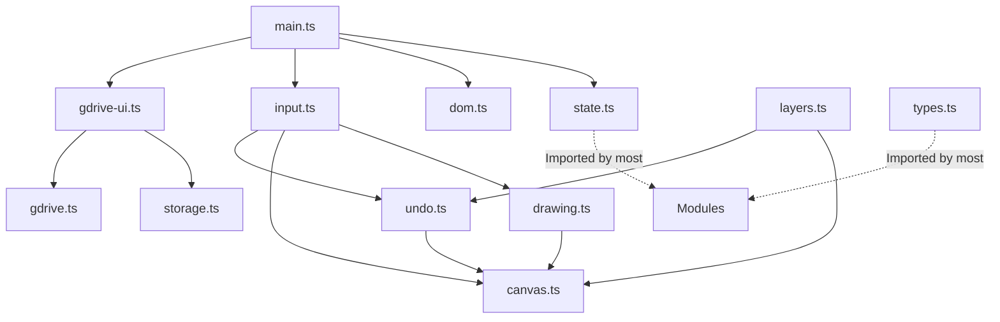

# Paint App Architecture

このドキュメントは、Paintアプリの現在のコード構造、モジュール構成、およびデータフローをまとめたものです。今後の機能追加やバグ修正の際のガイドとして機能します。

## 1. 全体構造 (Overview)

このプロジェクトは TypeScript と Vite をベースに構築されたブラウザベースのペイントアプリです。Google ドライブとの同期機能、レイヤー機能、マルチタッチジェスチャー（ピンチズーム・タップでのUndo/Redoなど）をサポートしています。

すべてのロジックは `src` ディレクトリ以下にモジュール化して配置されており、`main.ts` がエントリーポイントとして各モジュールを統合しています。

## 2. モジュール構成 (Modules)

### 2.1 コアデータと状態管理
* **`types.ts`**: アプリケーション全体で使用する共通の型定義（`Point`, `Layer`（ブレンドモード `blendMode: 'source-over' | 'multiply'` を含む）, `UndoEntry`, `TapRecord` など）。
* **`state.ts`**: アプリケーションのグローバルな状態（キャンバスのサイズ、現在のツール、選択中の色、レイヤー一覧、ビューの拡縮率・オフセットなど）。すべての可変な状態はここに集約され、`getter/setter` を通じてアクセスされます。
* **`dom.ts`**: HTMLテンプレートの挿入と、DOM要素（ボタン、キャンバス、入力フィールドなど）の参照エクスポートを行います。

### 2.2 描画とキャンバス制御
* **`canvas.ts`**: メインの描画領域の初期化、レイヤー合成（`compositeAndDisplay` および高速パス `compositeFast`）、サムネイル生成、PNG出力等で使用する全レイヤー合成キャンバス生成（`exportCompositeCanvas`）などを担当します。また、全端末間での画質劣化（保存データ読み込み時のリサンプリングによるボケ）を防止するため、`getCanvasDPR()` により最小解像度倍率（`Math.max(2, window.devicePixelRatio || 1)`）を保証・正規化してレイヤーキャンバスおよびキャッシュバッファ、ストロークバッファ (`strokeCanvas`) を生成します。クリッピングマスクの合成処理およびレイヤーごとの合成モード（通常 / 乗算）の適用を行います。また、「上下レイヤーキャッシュ（Smart Cache Engine）」を搭載しており、現在アクティブなクリッピンググループを境界に下位領域 (`lowerCacheCanvas`)・上位領域 (`upperCacheCanvas`) を事前合成してキャッシュし、描画ストロークや移動操作のホットパスでは `compositeFast` を呼び出すことで最速のレンダリングを実現しています。PNG保存などの画像エクスポート時にも `exportCompositeCanvas()` を用いることで、画面と全く同一の合成モード（乗算含む）およびクリッピング効果を適用した画像データを出力します。
* **`drawing.ts`**: ペンや消しゴムによる実際の描画処理。ストロークのスムージング（手ぶれ補正：指数平滑追尾）アルゴリズム、OKLCHベースのカラー計算、ペンのゆらぎ効果（筆圧風効果）設定、および線分描画における「端点重ね塗りによる黒ずみ・イモムシ現象」を完全に防止する「単一連続パス（Single Continuous Path Rendering）＋ストロークバッファ (`strokeCanvas`) 転写エンジン」を搭載しています。ストローク中は座標リストを連続した 1 本のパス (`beginPath -> moveTo -> lineTo...`) として `strokeCanvas` に一括描画してプレビューし、ペンを離した瞬間 (`commitStrokeToLayer`) に 1 回だけアクティブレイヤーへと合成・転写することで、半透明や等幅ペンにおける端点の重なり濃色化を完全に根絶します。また、手振れ補正 (Stabilize) の強度範囲を従来の 2 倍（最大 200）に拡張しつつ UI スライダーを `0〜100` に正規化（選択値 `X` に対して補正半径 `lazyRadius = 2X` を適用）しており、タッチ座標の極小距離（ノイズカットしきい値 `minPointDistance = 1.0px`）による微小微細ノイズカット判定を行い、かつ **「届いた点の最後の点は（MinDist 未満であってもスキップせずに）必ず描画する」仕様 (`isLastPoint = true`)** を組み込んでいます。

### 2.3 操作とUI
* **`input.ts`**: ユーザーからの入力イベント（マウス、ペン、タッチ）の処理。ピンチズームやパン操作、2本指タップでのUndo、3本指タップでのRedoなどのジェスチャー検出、およびレイヤー移動モード (`isLayerMoveMode`) 選択時のアクティブレイヤーのキャンバス上移動操作を管理します。レイヤー移動中も `compositeFast` により高速プレビュー描画を行います。また、ペンを離した際 (`pointerup`) には `commitStrokeToLayer()` を呼び出し、一時ストロークバッファの内容をレイヤーへ確定転写します。
* **`layers.ts`**: レイヤーの追加・削除、順序入れ替え（ドラッグ＆ドロップ）、クリッピングマスク・ブレンドモード処理。レイヤーパレット下部には「合成モード切り替え (通常/乗算)」トグルボタンと「レイヤー移動」ボタンを並べて配置しています。**合成モードの制約として、乗算 (`multiply`) は対象レイヤーがクリッピング (`clipped: true`) されている場合のみ有効化可能**であり、通常レイヤー (`clipped: false`) では常時 `source-over` に固定されます（クリッピング解除や並び替え時に自動リセット）。

### 2.4 データ保存と履歴
* **`undo.ts`**: Undo/Redo の履歴スタックの管理。ストローク描画、レイヤーの追加/削除/並び替え/クリッピング変更、およびレイヤー移動操作など、全てのアクションの状態を記録し復元します。
* **`storage.ts`**: ブラウザの `localStorage` へのデータ保存、読み込み、使用量の管理を行います。`LayerData` にブレンドモード情報を保持します。
* **`gdrive.ts`**: Google Identity Services (GIS) および Google Drive API との通信ロジック（認証、ファイルのアップロード/ダウンロード/削除）。API 呼び出し (`driveFetch`) において `HTTP 401 Unauthorized` を検出した際は、自動的にサイレントトークンリフレッシュ (`initAndLoginGDrive`) を試み、成功した場合は自動で当該 API リクエストを再試行するセルフヒール機能を搭載しています。
* **`gdrive-ui.ts`**: Googleドライブ連携のUI制御、ローカルデータからドライブへのマイグレーション処理、ステータス表示などを担当します。

## 3. データの流れ (Data Flow)

### 3.1 描画のフロー
1. ユーザーが画面にタッチ/クリックする (`input.ts`)
2. 座標が論理キャンバス座標に変換され、描画状態が記録される (`undo.ts`)
3. `PointerMove` イベント発火時、OS が取得したタッチ座標 (`minPointDistance` 以上の実移動距離がある点のみ) に対してスムージング処理を行います (`input.ts`, `drawing.ts`)
4. 決定されたスムージング座標列 (`currentStrokePoints`) をたどり、通常ペン描画時は **「単一連続パス (Single Continuous Path) として一時キャンバス (`strokeCanvas`) に一括でパスを描画」** します。これにより、従来の「短い線分ごとに独立して `stroke()` する」際に発生していた端点 (`lineCap = 'round'`) の重複重ね塗りによる濃淡ムラや黒ずみを 100% 防止します (`drawing.ts`)
5. 描画ストロークおよびレイヤー移動中のホットパスにおいては **`compositeFast()`** が呼ばれ、事前に構築された「下位キャッシュ (`lowerCacheCanvas`)」と「上位キャッシュ (`upperCacheCanvas`)」、および「現在のアクティブクリッピンググループ」、そして最上面に「一時ストロークバッファ (`strokeCanvas`)」が合成されてディスプレイの Canvas に超高速転送されます。
6. ストローク終了時 (`pointerup`) に **`commitStrokeToLayer()`** が呼ばれて一時ストロークバッファがアクティブレイヤーへと 1 回でマージ・転写されます (`drawing.ts`, `input.ts`)
7. レイヤーの選択変更・追加・削除等の構成変更時は **`compositeAndDisplay()`** が呼ばれ、全キャッシュが再構築されます。ストローク描画の Undo/Redo 時には **`compositeSmart(modifiedLayerId)`** が呼ばれ、変更レイヤーが現在のアクティブグループ内にある場合は上下キャッシュの再計算を完全スキップし、一瞬で表示を反映します。

### 3.2 保存のフロー (Cloud-First & Fallback Local Safety)
* **Google ドライブ接続時**: ローカルストレージ (`localStorage` 上限約 5MB) を圧迫しないよう、平常時は Google ドライブ上にのみ保存 (`saveToDrive`) します。API のトークン期限切れ時は `gdrive.ts` のセルフヒールにより自動的に再取得と再試行を行います。
* **フォールバック保存**: 万が一 Google ドライブへの通信や認証（自動リトライ含む）に失敗した場合に初めて、緊急バックアップとしてブラウザローカルストレージ (`localStorage`) に一時保存を行うフェイルセーフ設計となっています。

### 3.3 Undo/Redo のフロー
* **記録**: アクションが発生する直前に、対象レイヤーの `ImageData` や状態をコピーし、`undoStack` にPushします。
* **復元**: 2本指タップやCtrl+Zで `performUndo()` が呼ばれると、`undoStack` からエントリを取り出し、過去の `ImageData` やレイヤー状態を復元します。ストローク操作 (`type: 'stroke'`) の Undo/Redo は **`compositeSmart(layerId)`** を呼び出すことで、現在のアクティブグループ内の変更であれば \(O(0)\)（上下キャッシュ再構築なし）で超高速反映します。

## 4. 今後の開発に向けたガイドライン

1. **状態の追加**: 新しい状態（ツール設定など）を追加する場合は、必ず `state.ts` に追加し、getter/setterを用意してください。
2. **循環参照の回避**: モジュール間の循環参照（例: `layers.ts` と `undo.ts` がお互いを呼び出す）を防ぐため、依存関係は一方向にするか、`setRenderLayerList` のように関数を注入（Dependency Injection）する仕組みを利用してください。
3. **新規UIの追加**: 新しいUI要素を追加する場合は、`dom.ts` にテンプレートと要素の取得処理を追加し、各モジュールでそれをインポートしてリスナーを登録する形を取ります。
